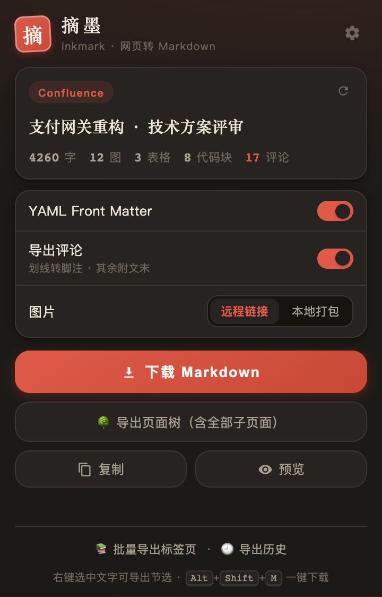
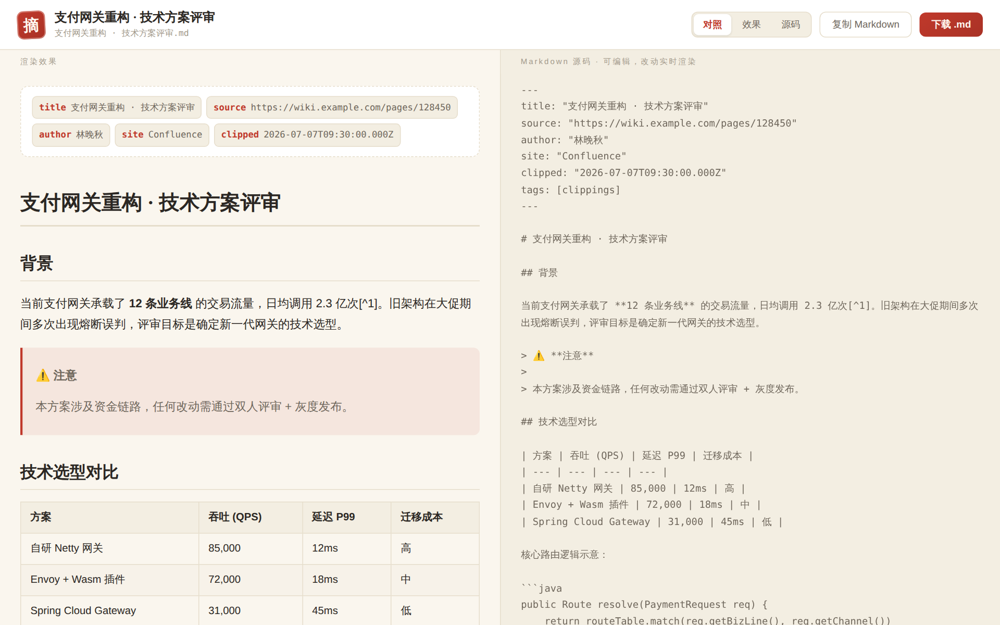

<div align="center">

# 摘墨 Inkmark

**把任意网页摘录为干净的 Markdown**

任意网页兜底导出 · Confluence / 飞书 / 公众号 / 知乎 / 掘金 / CSDN / 语雀 / Stack Overflow / X 精配
划线评论转脚注 · 页面树整库导出（分卷 · 断点续传）· iframe 正文提取 · 图片打包 ZIP · Obsidian 友好

</div>

---

<div align="center">
&nbsp;&nbsp;
<br><br>

<br><br>
&nbsp;
</div>

## 功能

- 🌐 **任意网页**：Readability 正文提取兜底，没有专门适配的网站也能导出
- 🎯 **站点精配**：Confluence（含评论）、飞书文档（数据接口精配、含评论，失败自动回退滚动采集）、微信公众号、知乎、掘金、CSDN、语雀、Stack Overflow（问题 + 全部回答结构化导出）、X/Twitter（主推文 + thread 续推为正文、回复进评论区，实验性）
- 🛠 **自定义站点规则**：不写代码，填「URL 包含 + 正文选择器」即可精配任何站点（内网系统友好），优先级高于内置适配器，失配自动回退
- 🪟 **iframe 正文提取**：正文藏在内嵌框架里的页面（网页邮箱、在线预览器）自动定位并提取——顶层优先，仅当顶层内容贫瘠且某个子框架显著更优时才切换，不被广告/评论 iframe 误导
- 💬 **评论导出**：划线评论锚定为脚注 `[^1]`，页面评论汇入文末「💬 评论」区，回复嵌套呈现，自动分页拉全
- 🧮 **公式还原**：KaTeX / MathJax / 知乎公式图 → `$LaTeX$` 源码
- 🖼 **图片两种策略**：保留远程链接，或并发抓取（自动携带登录态、20s 超时兜底）打包为 `assets/` + ZIP
- 📚 **批量导出**：把当前窗口多个标签页一次导出为一个 ZIP（按需授权，单页失败不影响整批），可选图片本地化打包（各页面内抓图、自动携带登录态）
- 🌳 **Confluence 页面树导出**：当前页 + 全部子孙页面一键导出，ZIP 目录镜像页面层级（REST API 驱动，不开标签页），评论可随树导出；超过 300 页自动**分卷打包**（每卷独立 ZIP，总量安全阀 3000 页），中断后可从卷边界**断点续传**
- 🕘 **导出历史**：最近 30 次导出可随时找回、重新下载或复制（仅存本机），同一文档去重、支持单条删除
- 📋 **多种出口**：下载 .md / 复制剪贴板 / 新标签页预览（对照·效果·源码三视图，双栏**锚点级同步滚动**，源码可编辑实时渲染）
- ✂️ **右键节选**：选中任意内容 → 右键 → 导出为 Markdown
- ⌨️ **快捷键**：`Alt+Shift+M` 一键下载当前页
- 🗂 **YAML Front Matter**：标题/来源/作者/摘录时间/自定义 tags，文件名模板 `{title} {domain} {date}`
- ✒️ **Markdown 风格可定制**：列表符号、强调符号、代码围栏、内联/引用式链接
- 🧱 **稳定性内建**：表格单元格块级内容自动扁平化（GFM 表格不再碎裂）、零宽字符清理、注入失败自动重试、进度实时回显
- 🌙 **深浅色主题**自动跟随系统，键盘焦点态与减动效偏好（`prefers-reduced-motion`）完整支持

## 安装（开发者模式）

1. 下载或 clone 本仓库
2. 打开 `chrome://extensions`，开启右上角「开发者模式」
3. 点「加载已解压的扩展程序」，选择仓库根目录

## 使用

点击工具栏上的朱砂印章图标 → 摘墨会自动分析当前页（显示命中的适配器、字数、图表与评论统计）→ 调整选项 → 下载 / 复制 / 预览。

设置页可配置默认行为：Front Matter、评论呈现方式（脚注/附录）、图片策略、文件名模板。

完整的安装与功能教程见 **[docs/USAGE.md](docs/USAGE.md)**。

## 架构

```
适配器层（每站点一个，Generic 兜底） → 中间表示 IR → 唯一的 Markdown 转换器 → 输出层
```

## 文档

| 文档 | 内容 |
| --- | --- |
| [docs/USAGE.md](docs/USAGE.md) | **使用教程**：安装与全部功能的详细用法（新用户从这里开始） |
| [CHANGELOG.md](CHANGELOG.md) | 版本更新日志 |
| [ROADMAP.md](ROADMAP.md) | 路线图（近期/中期/远期） |
| [CONTRIBUTING.md](CONTRIBUTING.md) | 开发指南：零构建、测试、适配器开发 SOP |
| [PRIVACY.md](PRIVACY.md) | 隐私说明与权限用途 |
| [docs/DESIGN.md](docs/DESIGN.md) | 完整设计文档：架构决策、各平台适配策略、历次迭代记录 |
| [docs/ACCEPTANCE.md](docs/ACCEPTANCE.md) | 真机验收清单：主路径（Confluence/飞书）定期线上抽检 |

## 开发与测试

```bash
npm install playwright          # 测试依赖（仅本地）
node test/e2e.js                # 真实 Chromium 中跑全管线断言（217 项）
# 使用系统已有浏览器：CHROMIUM_PATH=/path/to/chrome node test/e2e.js
node scripts/pack.mjs           # 打包分发 zip → dist/inkmark-v<版本>.zip（仅含运行时文件）
```

平台改版导致适配器失效时：把新版页面 HTML 存入 `test/fixtures/`，修对应适配器的选择器，测试转绿即修复。详见 [CONTRIBUTING.md](CONTRIBUTING.md)。

PR 与 main 推送会在 GitHub Actions 上自动跑全量 e2e（[.github/workflows/e2e.yml](.github/workflows/e2e.yml)）。

## 第三方库

[Readability](https://github.com/mozilla/readability) · [Turndown](https://github.com/mixmark-io/turndown) (+ GFM 插件) · [JSZip](https://stuk.github.io/jszip/) · [marked](https://marked.js.org/)（仅预览页）

## License

见 [LICENSE](LICENSE)。
